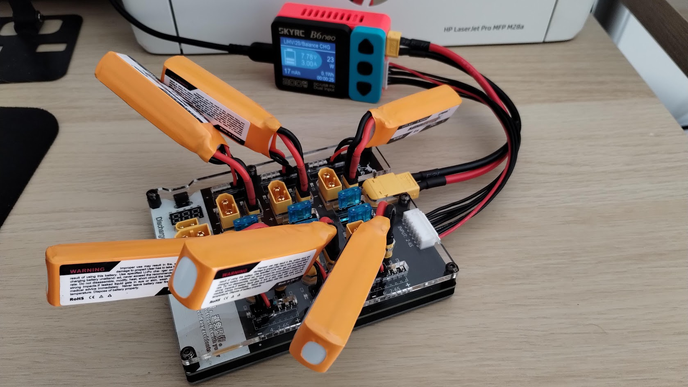
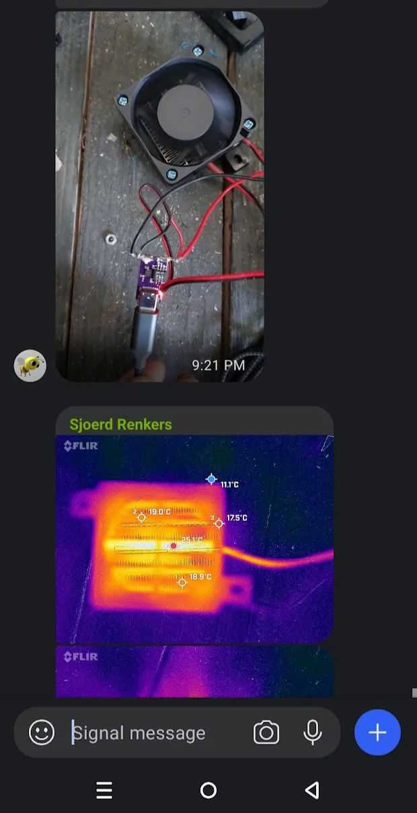
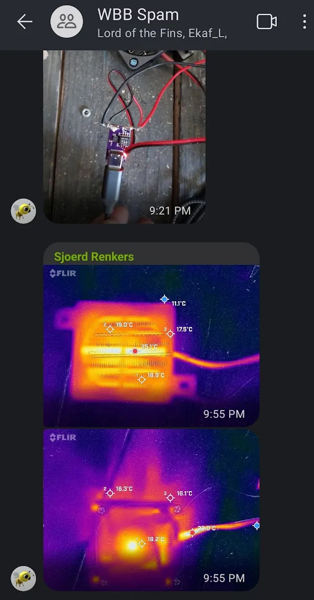

# Ящик фірми Фізік і друзі.

# Building a network

---

### **Фальш-кришка**

---

### **Послідовність дій**

1. [Придбати кейс. **(Вже придбані)**](https://paton.ua/en/aksessuary/kejsy-i-boksy-dlya-svarochnogo-apparata/kejs-plastikovij-paton-unversalnij/)
2. Підготувати платки, визначити спосіб кріплення.
3. Продумати спосіб розміщення батарей,  та зарядного пристрою для батарей.

1. Розробити 3D-моделі (або узяти готові)
    - Ячеєк для батарей
    - Кріплення для планшета
    - Фальш-кришки

---

# **Технічні характеристики**

- АКБ: 12V BMC, 12.6V, Li-Ion 60Ah
- Формат батарей: банки - **lets ellaborate it**

- Герметик: силіконовий, необхідно продумати як прокладати проводки та з’єднання(поки нахер, раз у нас є кейс)

- Ячейки для батарей: тонкий текстоліт або 3D-друк [https://www.aliexpress.com/item/1005007065749338.html](https://www.aliexpress.com/item/1005007065749338.html?businessType=ProductDetail&srcSns=sns_Copy&spreadType=socialShare&bizType=ProductDetail&social_params=60857219396&aff_fcid=16e6911eea5c4c36ae9b995ce148700f-1748457141631-08233-_EJCWsQl&tt=CPS_NORMAL&aff_fsk=_EJCWsQl&aff_platform=shareComponent-detail&sk=_EJCWsQl&aff_trace_key=16e6911eea5c4c36ae9b995ce148700f-1748457141631-08233-_EJCWsQl&shareId=60857219396&businessType=ProductDetail&platform=AE&terminal_id=ad582918c4a54f54a5407498e8ee932c)

---

### **Зарядний пристрій для АКБ**

---

### Плати зарядки: 3 шт. (QC)

## Inventor

[https://www.facebook.com/reel/1489888742509109](https://www.facebook.com/reel/1489888742509109)

---

## Batteries

---

## Охолодження

## Захист

Чого немає зовсім в вашому файлі так це жодного захисту, ні від ураження струмом, ні від коротких замикань

**Заповнювач**

**Виведення температури**

**Заземлення**

---

### **Планшети та зберігання**

> **Нотатка: це все обговорюється. Це тіки перша версія. Все повинно бути швидко та дешево.**
> 
- Кріплення для одного планшета (на кришці) — стаціонарне, без поворотних елементів, з можливістю зняття
- 2 інших планшета — транспортуються в загальному відсіку, без окремих кріплень (можна з проложкою)
- Необхідно залишити місце для додаткового транспортування

---

---

### Inspiration

[https://prom.ua/ua/p2627239119-xt60-parallelnyj-soedinitel.html](https://prom.ua/ua/p2627239119-xt60-parallelnyj-soedinitel.html)

[https://oscarliang.com/parallel-charging-multiple-lipo/](https://oscarliang.com/parallel-charging-multiple-lipo/) 

[https://www.instructables.com/Parallel-Lipo-batteries-charging/](https://www.instructables.com/Parallel-Lipo-batteries-charging/) 

---

[https://www.hglrc.com/products/hglrc-thor-lipo-battery-balance-charger-board-pro-40a-xt60-xt30-plug-2-6s-integrated-with-lipo-discharger-for-imax-b6-isdt-q6-nano-hota-d6-pro-p6](https://www.hglrc.com/products/hglrc-thor-lipo-battery-balance-charger-board-pro-40a-xt60-xt30-plug-2-6s-integrated-with-lipo-discharger-for-imax-b6-isdt-q6-nano-hota-d6-pro-p6) 

[https://www.hglrc.com/collections/charger/products/hglrc-thor-6-port-lipo-battery-balance-charger-board-pro-40a-xt60-xt30-plug-2-6s-integrated-with-lipo-discharger-for-imax-b6-isdt-q6-nano-hota-d6-pro-p6](https://www.hglrc.com/collections/charger/products/hglrc-thor-6-port-lipo-battery-balance-charger-board-pro-40a-xt60-xt30-plug-2-6s-integrated-with-lipo-discharger-for-imax-b6-isdt-q6-nano-hota-d6-pro-p6) 

---

[https://www.youtube.com/watch?v=HwUkkyUIOOk](https://www.youtube.com/watch?v=HwUkkyUIOOk) 

# Нотатки

---

---

## Vadim 22/05/2025

---

---

## **Віталій 25/05/2025**

---

## Documents for sharing - LISTS

## **Awesome YT tutorial**

---

# 3D things

### STLs to print

### 3d model for corners

---

### EVERYTHING ELSE

---

хаб для планшета

ниже пока что мусорник

