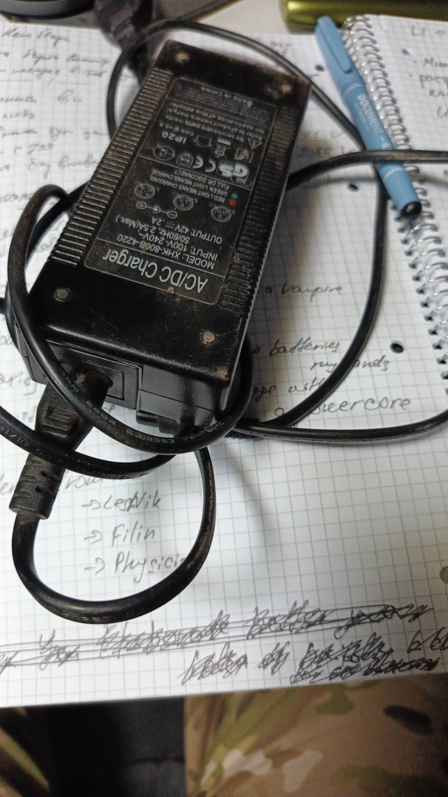

# Chat with great and smart people

Can you elaborate more of your idea/process for building this charger for FPV batteries?
I wanna record everything in github, to make it more managable and visible to donors?

im also preparing some information about the text task that i want to give you to brainstorm

In common terms, I would be making a DC to DC converter to achieve maximum efficiency in moving power from the internal battery packs to the fpv packs while monitoring for the correct charging parameters to maximize battery life. 

But the basic intent is to make one circuit do all of the work with only one time converting the voltage, rather than having to go through the energy losses of multiple conversions. This should make it cheaper to make and make it run more efficiently so the charge pack can last for charging more fpv batteries. 

so there is a fancy rc toolkit for charging batteries. costs about $100. you want to simplify it, make it stand alone an something?[https://www.aliexpress.com/item/1005006294893307.html](https://www.aliexpress.com/item/1005006294893307.html)

Can you make it sound good that I'm making it hopefully cost 1/5 as much per unit, and be more reliable and rugged because it can stay inside your waterproof case instead of having the screen and everything exposed to take damage from dirt mud and rain? 

yeah - we dont need all fanciness. it just should work 

you wanna build a curcuit board from scratch?
10:54 PM

💯

⁨Robherc⁩
I prefer to make things so, it. Just. Works.
10:54 PM

elaborate the process, when you got all the details from Max Lighthouse. is this some sort of modeling in software and then you upload your schema into some device...
10:55 PM

⁨Robherc⁩
My process is once I know exactly what power numbers I have to work with, I do modeling on the inductor coil that will do it be doing most of the work, and select the most available and lowest cost coil that will be able to do everything we need; then I choose the other components to support it based on that coil. After that it usually takes me 1 to 3 days working in my electronics design software to make and verify all of the circuits for the PCB that I then send off the PCB files to a manufacturer to make in large quantities for us to solder the components on once they are finished
10:57 PM

PCB is?
10:58 PM

⁨Robherc⁩
Printed circuit board, it's the green board with copper on it inside most everything you own that is electronic
10:58 PM

so you can build an Iphone for me, right?
10:59 PM

⁨Robherc⁩
Sorry, that has too many components that are way too small for me to work on without more complex machinery LOL
10:59 PM

❤️

But it costs the money, how much do you think will cost one board, imagining that we have costs for 100+ items.
just a ballpark price will be fine. i want to have some sort of an estimate
11:00 PM

⁨Robherc⁩
I haven't priced out any components yet, because I don't have all the numbers. But I am hoping for below $20 per unit if we are making in groups of 100
11:00 PM

I assume each battery should have a separated PCB, so for example, for a case with 8 batteries we will use 8 PCBs
11:01 PM

⁨Robherc⁩
Are we charging the batteries inside the case, or is this for charging batteries for the pilots to use outside of the case?

great question.
there will be 2 type of cases in the future.

- One for supporting reconaissance teams (charging batteries inside the case)
- Second for supporting fpv teams (case is basically a charger for FPV batteries)

but it's a long road so my focus right now is the first option
11:03 PM

⁨Robherc⁩
Okay, so where is the power coming from then

I guess I misunderstood and thought we were working on something to charge fpv batteries from an internal battery pack
11:04 PM

before our idea was to have some sort of cheap dell laptop charger
11:05 PM

⁨Robherc⁩
So then the power is coming from 220v ac?
11:06 PM

yes, power will come from 220 gasoline inverter generator
11:06 PM

⁨Robherc⁩
Okay, then that will change my design a little bit, but I should be able to make one board that just take a regular 220v plug and converts that to charge as many batteries as you tell me to put connectors on it for

 have alot of these ! For freeee 

I mean, if that charger will charge all of your battery packs at once, while keeping your cells balanced and not overcharging any, then I guess go ahead and use it as and you don't need a separate charging circuit. However, if it won't handle directly charging the batteries without needing more circuits, I don't see much benefit to adding another thing that can break as well as another thing that uses up some of the power in the process.

Yes, I pay more attention to driving than messages which is why I made the mistake LOL 

The good news there is, I should be able to make a circuit to charge eight batteries for maybe 2x to 3x as much cost as it would take to make a circuit to charge One battery. So it is definitely better to make a single circuit to charge all eight batteries instead of using eight single battery circuits for more money.

the problem is to delivering the power from AC/DC into the fpv batteries.

this is the job of rc toolkit

i love this idea. but we still dont know how much batteries inside will be for each particular case.

so i assume our plan can be:

create a separate PCB for charging each battery separately for the first set of 5-10 cases.

then break everything, hate each others, scream, etc. when we will calm down and think.

after that we will make the design a concrete version. or maybe like having 3 versions:

- quick, cheap, simple, lightweight. for example for 800kw
- better version for 1200kw
- titan version for 1900kw that might replace an ecoflow for $800

I assume you meant kwh here and not kw. As 1900 KW is enough power to run most neighborhoods LOL

And actually 1900 kwh would run the entire neighborhood for an hour

But if we don't know how many batteries will fit in each case, can we pick a number that we are sure we won't go above, like maybe 10? And then I can make the board so it can charge anything from one to 10 batteries at the same time?

sure we can, we have a lot of limitations. like price, like weight and a space inside of the case.

im asking Mr.S for checking if we can buy cheap plastic cases with handles with a smaller size. with the latest case from max, where we put inside 3 batteries inside - there too much free room inside
11:22 PM

⁨Robherc⁩
Because I think if we make one charging board for ideally all of our different cases that we're going to make, it hurts nothing to plug in fewer batteries on a large board , but it can make production a lot more expensive and difficult to try to make three different boards instead of just making three times as many of one board.
Edited11:24 PM

p

⁨plasticisfantastic⁩
You should make 3 versions.
Light
Medium
Heavy
11:26 PM

❤️

⁨plasticisfantastic⁩
I've made 1 kWh under 10 kg

p

And under 178€
11:27 PM

⁨Robherc⁩
One question I must ask though, is it important that these be able to pass a CE inspection? Because if we have it use the 220v AC directly, then many European countries would say it cannot be used unless it goes through the full CE verification process.
11:27 PM

p

⁨plasticisfantastic⁩
Lol , fuck CE label
11:27 PM

❤️

p

⁨plasticisfantastic⁩
Means nothing
11:27 PM

⁨Robherc⁩
That's what I was assuming, but I wanted to make sure that it wasn't assumed that I was talking about making something that was fully compliant and it was not
11:28 PM

p

⁨plasticisfantastic⁩
As long the powerstation doesnt feed the grid, ya good 🤣
11:28 PM

btw, what about cooling and something. will it require having some radiators, fans inside too?
11:29 PM

⁨Robherc⁩
Yes, and I intend to make it so it's still probably meets all the standards.. just that we don't really want to spend the time and money having an independent lab do all of the required testing I don't think
11:29 PM

p

⁨plasticisfantastic⁩
[https://docs.google.com/document/d/1UMfly0OfGN5JFdITxgCq4EVsNlpK3LJ0mGq1wbi26cs/edit?usp=drivesdk](https://docs.google.com/document/d/1UMfly0OfGN5JFdITxgCq4EVsNlpK3LJ0mGq1wbi26cs/edit?usp=drivesdk)
11:29 PM

❤️

⁨plasticisfantastic⁩
Don't know you guys can see this

p

This was my list

Yes, even if only for the batteries
11:30 PM

p

⁨plasticisfantastic⁩
Using ammo boxes or toolboxes
11:32 PM

⁨Robherc⁩
If we're using metal ammo boxes, we can get rid of a lot of heat through the box itself using it as a radiator.
11:33 PM

⁨plasticisfantastic⁩
I used a plastic. Cheap as fuck and very stronkkk

p

But metal is also good
11:33 PM

⁨Robherc⁩
Plastic is fine too, just then we have to use fans for certain because plastic doesn't get rid of heat very well for us

here are images for the 3rd case: [https://github.com/atherdon/fuck-ecoflow/blob/main/docs/charging-station/03-number-three/Number Three 3752d71d806980068346fc6cad4f6dde.md](https://github.com/atherdon/fuck-ecoflow/blob/main/docs/charging-station/03-number-three/Number%20Three%203752d71d806980068346fc6cad4f6dde.md)

i think there a lot of space inside, so maybe using a smaller toolboxes will be  betterhttps://www.aliexpress.com/item/1005007922241712.html
11:34 PM

⁨plasticisfantastic⁩
Those are too small

p

Been there done that
11:36 PM

❗

⁨Robherc⁩
Okay, just to get rid of any continuing confusion I might have.. can someone please paint me a full picture of what we are doing with the cases. I understand now that what we're discussing in the moment is a circuit to charge fpv batteries inside the case. Once the fpv batteries inside the case are charged, what are we doing with the power then?

we dont have a lot of ammoboxes. usually soldiers picking them as souvenirs, and dont want to share a lot.

Rn i have only one box in my hands, others i gave away for making a charging station by Antey Energy boiz.
Wanna establish a solid contact with them, but still they are bizi and dont want to get me inside:
[https://github.com/atherdon/fuck-ecoflow/blob/main/docs/charging-station/inspiration/antey-energy/Antey Energy Charging Station.md](https://github.com/atherdon/fuck-ecoflow/blob/main/docs/charging-station/inspiration/antey-energy/Antey%20Energy%20Charging%20Station.md)
11:36 PM

p

⁨plasticisfantastic⁩
[https://amerikaantje.be/product-category/uitrusting/jacht/munitiekoffers/](https://amerikaantje.be/product-category/uitrusting/jacht/munitiekoffers/)

How to charge them is our problem for now. I can ask @Lighthouse about that - but this is what we recently figure out.

from the begingng we were welding 21700 batteries together and applying some magic for charging that.

but as we are lazy and get some fancy batteries - this problem appears
11:38 PM

p

⁨plasticisfantastic⁩
Check these prices
11:38 PM

still too much, but can be our go to option for sure

I can get a whole pallet of ammo boxes and take them to the port if someone can get them moved to you by ship LOL
11:39 PM

p

⁨plasticisfantastic⁩
Eyes on Ukraine pay for it

same prices here, i though about asking Emanuelle to buy some of themhttps://military.eu/ua/c/taktichne-sporjadzhennja/jaschiki 

can work, but not sure if its still the best option. but at least we can give them away to Antey Energy and melt the ice...
11:41 PM

p

⁨plasticisfantastic⁩
Don't think about money to hard right now. We need progress first, and after that we can cut down prices
11:41 PM

⁨Robherc⁩
Can I ask what is the reason we are using fpv batteries?

Are they being taken out of the case to use for flying drones, or are they just saving us from having to weld 18650 batteries together? 

elaborate it. you want to jump start the normal LiFePo batteries?
11:43 PM

p

⁨plasticisfantastic⁩
Lifepo is easier to repair, swap,build, etc 

I like the big ones that we would only have to use maybe 12 of and they come with M6 or M8 bolts to make the connections

Also the lifepo4 batteries don't like to burn nearly as much, with as often as you get hit that might be a big help LOL

in the future, when we are not so broke - maybe we can jump into big batteries.

in short: biggest price of the charging stations is the battery pack. and we solved this problem with the help of PlasticFantastic and this stupid war.

imagine this: fpv newbie pilot is flying first time the drone. he hit the tree and damage the drone and a battery. it cant be used anymore. so we get those batteries from fpv unit, and cannibilize it.

put here a link so we can later review it

im fine with any changes in the future

See, that's the answer I was waiting for. I asked why we were using fpv batteries, if you said then because they are free from people damaging them that would explain LOL

I just found this on AliExpress:
1-8pcs LiitoKala 60145 60140 3.2V 50Ah LifePo4 battery for diy 12V 24V 48V 50Ah solar Inverter electric vehicle coach golf carthttps://a.aliexpress.com/_mPkQRYF

Those might or might not be the best option to use that particular battery cell, but it shows what I mean by being able to make a power pack with no welding using lifepo4 batteries and it be easier to make it work and easier to fix it when a cell gets damaged.

Yes. Makes it more expensive but if we got donations, hell is open for building
59m

while you think about batteries - dont think like this case will work more than 1-2 months. so only for positions that outside the killzone it's important to count battery cycles
59m

p

⁨plasticisfantastic⁩
It's gonna be cheaper in the end as regular stations
59m

for positions like mavic - they are in a deep shit. so when they will be exposed - they will run away and destroy the case

Especially since a regular station with $150 worth of batteries is costing $470

In that situation I very much prefer that they destroy the case than get themselves killed trying to protect a piece of plastic with batteries in it!

Key words are upscaling, ergonomic, safe, and cheap
And usefull ofc
54m

⁨Robherc⁩
My keywords are series count, Peak current required per battery, and max number of batteries LOL
53m

Today

⁨Robherc⁩
.. knowing the maximum available input power wouldn't hurt either hehehe

( because it would not be good for my charging circuit to try to pull 20 amps from a 2kw generator)