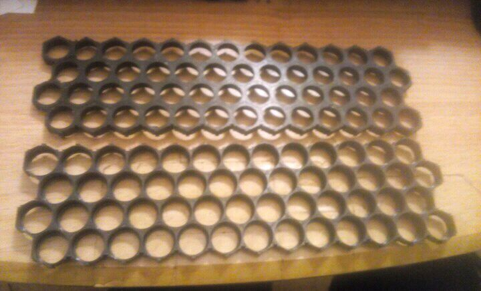
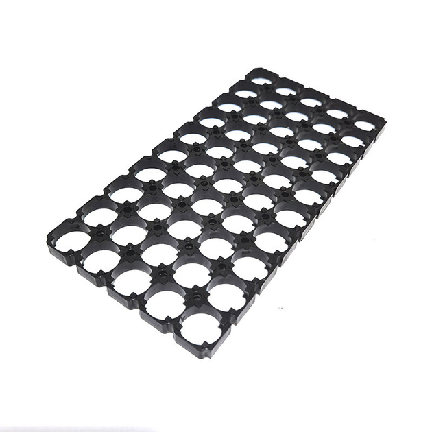
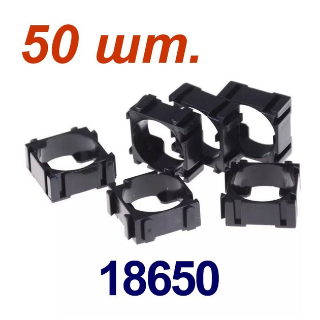

# Batteries

Arthur:

### Варанти:

- покупка своих нових 18650
- использование lifepo4
- to use hoverboard batteries

у нас точно сейчас есть одна фпв батарейка - можем ее заряжать кстати у Фізика дома?

у нас точно есть контакти 2-3 пацанов - Алех из Перевірена бавовна та Едрон та КрабБаттеріез. они я думаю нам по нормалной цене просто сделают ту сборку которая нам нуна для какой то первой версии и ми не будем тразать себе мозг - заказавить обладнання и тд.

А ось тут будут перші нюанси особливо з характеристиками на продаж.

На фпв роблять з акб висострумових і в них значно меньше ємність ніж в тих що брав я, але ті що брав я не підходять для фпв бо не буде стільки струму для потужності)

Ну наприклад один елемент акб для фпв має ємність біля 3000 мАч але може віддати багато Ампер, і коштує через це біля 200 грн за шт , на одну батку для фпв треба 18 таких.

А з тих що я робив вони мають ємність 5800 мАч але не віддають такий струм як треба фпв (але для станцій з головою) і коштують по 130-140грн/шт і на ту збірку що я робив треба їх 30шт.

Краще з тих баток фпв, розібрати протетсиити всі банки (на зарядному пристрої) викинути спорчені і зібрати знов батки для фпв.

---

### option 3

[**Акумулятори lifepo4 замість li ion** (1)](https://app.notion.com/p/lifepo4-li-ion-1-2132d71d80698054a8d3f92fdb90f181?pvs=21)

---

### option 4

[hoverboard batteries (1)](https://app.notion.com/p/hoverboard-batteries-1-2132d71d806980218a01d764d5f02580?pvs=21)

### **Batteries holders and demphers**

> Примітка: скоріш за все холдери будуть печататись у Люксембурзі під замовлення
> 

Holder для батарей

