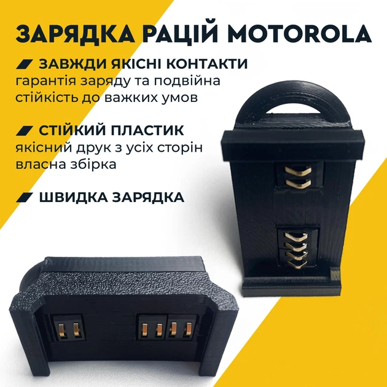

# Frog v1.

### 1. "Frog"

Motorola never thought their radios would be used in this way. Therefore they made an output for charging[...]

This allows our guys to charge the radios from power banks.

Capacity: 40 pcs will go into operation at once. These things need to be made constantly. You need to order the boards in advance cod[...]

Ready-made ones are sold for 200–400 UAH. For example, I can easily distribute 40 pcs to infantry companies.

[https://rozetka.com.ua/ua/522259339/p522259339](https://rozetka.com.ua/ua/522259339/p522259339) 

---
