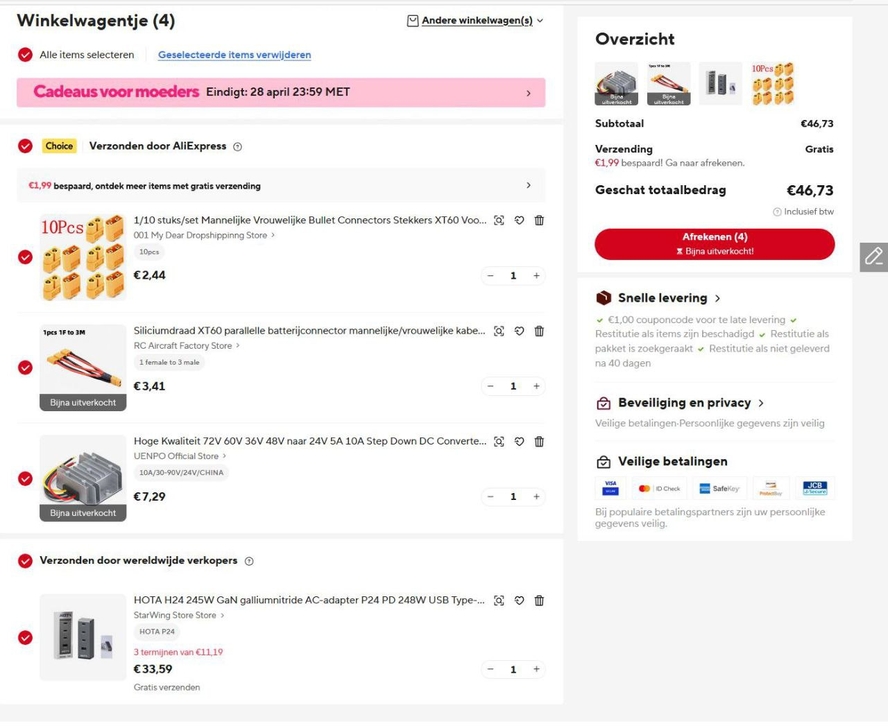

# Case #0 - Proof of concept - Mr.S 27.05.25

Created: June 6, 2025 8:01 AM

### **Proof of concept - 27.04.25 Артур - Sjoerd**

I added this:

**1 female to 3 male XT 60 combiner** to connect up to 3 battery packs in parallel

The list so far to build power stations based on hoverboard batteries

**Silicon wire XT60 parallel battery connector male/female cable double extension Y splitter**
[https://nl.aliexpress.com/item/1005007015471691.html](https://nl.aliexpress.com/item/1005007015471691.html)

**XT60 male connector**
To connect combiner cable to step down converter

**XT60 female connector**
To connect step down converter to Hota(Hota is probably like a replacement for usd ports)

I did not yet bother about how to charge the battery packs

<aside>
💡

Шо з цим типом батарей? Будемо робити розголожувач? Сьоред так зробив свій пруф-оф-консепт.

</aside>

> HOTA is a usb hub - lets consiwder an idea of usiwng a simple usb hub on a glue to make things happens cheaper.
> 

[https://pyrodrone.com/products/hota-p24-pd-charger-248w-usb-w-xt60-input-grey](https://pyrodrone.com/products/hota-p24-pd-charger-248w-usb-w-xt60-input-grey?srsltid=AfmBOopC-5ZHtzrh7PklSdG9m1NSR0HgAxlavM16KLld35b77LixP-Ex)

[https://www.aliexpress.com/item/1005006759391946.html](https://www.aliexpress.com/item/1005006759391946.html)

## Sjoerd`s proof-of-concept May 23th

`signal-2025-05-23-10-54-15-840.mp4`
