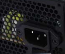

# Зарядний пристрій для АКБ

- Зарядний пристрій: для 12.6V АКБ

чи будемо ми пробувати брати стандартний блочек чи шось інше 

- Вихід живлення ( як у комп’ютерного БП ) [https://relcoma.com.ua/ru/gnezdo-setevoe-na-korpus-s-zaglushkoj-s14](https://relcoma.com.ua/ru/gnezdo-setevoe-na-korpus-s-zaglushkoj-s14)

- Кабель 220V для зарядки батарейки

<aside>
💡

Zарядка від 220 простіше реалізувати зовнішю через блок живлення (типу як ноут), але якщо треба то можно і вбудувати її всередину і назовні буде підключатись лише кабель для 220 (як на тій зарядній станції що я робив)

</aside>

[https://www.aliexpress.com/item/1005005541371554.html](https://www.aliexpress.com/item/1005005541371554.html?spm=a2g0o.productlist.main.16.1362MZN7MZN7Zt&aem_p4p_detail=202506062105513110034287859060002127724&algo_pvid=ebbc19da-304b-4af2-8bb2-85752948b635&algo_exp_id=ebbc19da-304b-4af2-8bb2-85752948b635-15&pdp_ext_f=%7B%22order%22%3A%2246%22%2C%22eval%22%3A%221%22%7D&pdp_npi=4%40dis%21UAH%21465.83%21465.83%21%21%2172.10%2172.10%21%40211b80c217492691515672499ed384%2112000033643195558%21sea%21UA%210%21ABX&curPageLogUid=0abMWcgAMUGu&utparam-url=scene%3Asearch%7Cquery_from%3A&search_p4p_id=202506062105513110034287859060002127724_6)

[https://www.aliexpress.com/w/wholesale-dell-65w-charger.html](https://www.aliexpress.com/item/1005008534145414.html?spm=a2g0o.productlist.main.1.1362332eG4Laiu&aem_p4p_detail=202506062207444079409995137740002092905&algo_pvid=ee0c12e2-3f5d-4c40-bb7b-37b1654402fb&algo_exp_id=ee0c12e2-3f5d-4c40-bb7b-37b1654402fb-0&pdp_ext_f=%7B%22order%22%3A%22299%22%2C%22eval%22%3A%221%22%7D&pdp_npi=4%40dis%21UAH%21702.17%21540.57%21%21%21108.68%2183.67%21%402101584917492728644307098e0e18%2112000045609174161%21sea%21UA%210%21ABX&curPageLogUid=ECW7JLeTZzdt&utparam-url=scene%3Asearch%7Cquery_from%3A&search_p4p_id=202506062207444079409995137740002092905_1) 

abo 

[https://www.aliexpress.com/item/1005005541371554.html](https://www.aliexpress.com/item/1005005541371554.html?spm=a2g0o.productlist.main.16.1362332eG4Laiu&aem_p4p_detail=202506062207444079409995137740002092905&algo_pvid=ee0c12e2-3f5d-4c40-bb7b-37b1654402fb&algo_exp_id=ee0c12e2-3f5d-4c40-bb7b-37b1654402fb-15&pdp_ext_f=%7B%22order%22%3A%2246%22%2C%22eval%22%3A%221%22%7D&pdp_npi=4%40dis%21UAH%21465.83%21465.83%21%21%2172.10%2172.10%21%402101584917492728644307098e0e18%2112000033643195558%21sea%21UA%210%21ABX&curPageLogUid=XK8T6rLPZq4V&utparam-url=scene%3Asearch%7Cquery_from%3A&search_p4p_id=202506062207444079409995137740002092905_6)

додати блок живлення від будь якого ноутбука Делл до 65 ват, тоді виходить що контролер заміняє ці всі блоки і перетворює на напругу яка необхідна для заряду акб, окрім 220, там працює додатково блок живлення.