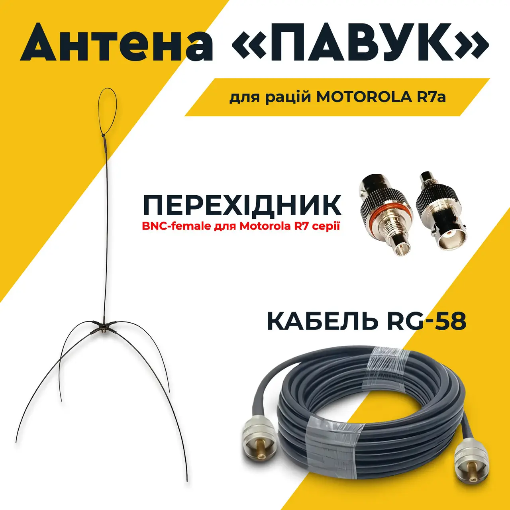

# 5. «Павук»

Павук незамінна штука на позиції при умовах роботи з радіостанцією. Проблема в чому - купляти їх постіно - це накладно. Система дуже проста - це просто коаксікальний кабель якогось розміру - який подовжує антенну на рації. Тобто можливо тримати рацію у бліндажі - цей павук кидається на якесь дерево та якість звєязку виростає

В ситуації коли связистів, ребовців та пілотів розбирають кабами та фпв - важко постійно ьримаьи звєязок на рівні. Бо все може вийти з ладу.

Як я вже сказав - система ця дуже проста. Щоб її зробити руками - не треба майже нічого. Купляються коннектори, купляється бухта цього коаксикального кабеля, обжимка і воно вже буде працювати. 

відео русаків

[https://www.youtube.com/watch?v=ES4G9ZNl-_M](https://www.youtube.com/watch?v=ES4G9ZNl-_M)

[https://www.youtube.com/watch?v=1AUsnAfmH-E](https://www.youtube.com/watch?v=1AUsnAfmH-E)